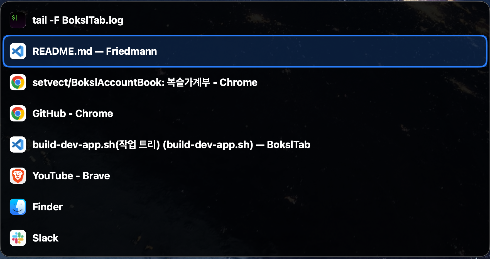

# BokslTab

BokslTab은 macOS용 AltTab 스타일 앱/창 전환기 프로토타입입니다.

목표는 완성형 제품이 아니라, macOS 앱/창 전환 UX와 OMX/Codex 기반 개발 흐름을 검증하는 작은 MVP입니다.

## 기능

- 모든 앱/창 목록 표시 및 전환
- 현재 활성 앱의 창 목록 표시 및 전환
- 앱 아이콘 + 창 제목 표시
- macOS 탭 그룹은 가능한 경우 탭별 창처럼 표시
- 키보드/마우스 선택 이동
- `Command + Tab`, `Option + Tab` 전역 단축키

실행화면


제외 범위: 창 썸네일, 설정 화면, 자동 업데이트, 정식 배포 자동화

## 빠른 시작

요구사항: macOS 13 이상, Xcode Command Line Tools 또는 Xcode

```bash
./scripts/build-dev-app.sh
open .build/dev-app/BokslTab.app
```

처음 실행하면 손쉬운 사용 권한을 허용합니다.

```text
시스템 설정 > 개인정보 보호 및 보안 > 손쉬운 사용 > BokslTab 허용
```

개발 중에는 `swift run BokslTab`보다 개발용 `.app` 실행을 권장합니다.

## 사용 방법

| 동작 | 단축키 |
| --- | --- |
| 모든 앱/창 전환 | `Command + Tab` |
| 활성 앱 창 전환 | `Option + Tab` |
| 다음 항목 | `Tab`, `↓`, `→` (`Tab`을 길게 누르면 연속 이동) |
| 이전 항목 | `Shift + Tab`, `↑`, `←` (목록이 열린 상태에서 `Command + Shift` 또는 `Option + Shift`를 길게 누르면 연속 이동) |
| 선택 항목으로 전환 | `Enter`, `Space` |
| 취소 | `Esc` |

`Command` 또는 `Option` 키를 떼면 현재 선택된 항목으로 전환되고 패널이 닫힙니다.

메뉴바 아이콘에서도 `모든 앱/창 보기`, `활성 앱 창 보기`, `종료`를 실행할 수 있습니다.

## 개발 명령

| 목적 | 명령 |
| --- | --- |
| Debug 빌드 | `swift build` |
| Release 빌드 | `swift build -c release` |
| 테스트 | `swift test` |
| Smoke test | `.build/debug/BokslTab --smoke-test` |
| 개발용 앱 생성 | `./scripts/build-dev-app.sh` |
| 개발용 앱 실행 | `open .build/dev-app/BokslTab.app` |

개발용 앱 생성 위치:

```text
.build/dev-app/BokslTab.app
```

## 권한 메모

BokslTab은 다른 앱의 창을 찾고 전환하기 때문에 손쉬운 사용 권한이 필요합니다.

`swift run BokslTab`으로 실행하면 macOS 권한 화면에서 `BokslTab`이 아니라 `Terminal`, `iTerm`, `swift`로 인식될 수 있습니다. 권한 테스트는 개발용 `.app`으로 진행하세요.

소스 변경 후 권한을 계속 다시 요구한다면 아래 명령으로 서명 요구조건을 확인합니다.

```bash
codesign -d -r- .build/dev-app/BokslTab.app
```

정상 출력:

```text
designated => identifier "dev.boksl.BokslTab"
```

## 문제 해결

### 단축키가 동작하지 않음

손쉬운 사용 권한을 허용한 뒤 BokslTab을 재실행합니다. 필요하면 로그를 확인합니다.

```bash
tail -f ~/Library/Logs/BokslTab/BokslTab.log
```

### macOS 기본 Cmd+Tab 복구

BokslTab이 비정상 종료되면 macOS 기본 `Command + Tab` 상태가 남아 있을 수 있습니다.

```bash
.build/dev-app/BokslTab.app/Contents/MacOS/BokslTab --restore-native-command-tab
```

### 창 제목이 비어 있음

macOS 권한이나 앱 상태에 따라 창 제목을 가져오지 못할 수 있습니다. 이 경우 fallback 제목이 표시될 수 있습니다.

### IntelliJ 탭 그룹 확인

IntelliJ에서 여러 프로젝트를 연 뒤 `Window > Merge All Project Windows`를 실행합니다. BokslTab 목록에서 각 프로젝트 탭이 별도 항목으로 보이고 선택 시 해당 탭으로 이동하는지 확인합니다. 지원 앱 allowlist에서 direct `AXTabs` 또는 창 바로 아래의 네이티브 `AXTabGroup`/`AXTabButton`으로 노출되는 macOS 탭을 펼치며, 브라우저 내부 웹 탭은 펼치지 않습니다. 로그에는 `window-catalog.ax.tabs`, `window-activation.ax.tab` 항목이 남습니다.

## 설치 / 배포

현재 산출물은 개발용 앱입니다.

```text
.build/dev-app/BokslTab.app
```

다른 Mac에 안정적으로 배포하려면 Developer ID 서명, 공증, DMG/PKG 작업이 추가로 필요합니다.

## 관련 문서

- `docs/requirements.md`
- `docs/prd.md`
- `docs/architecture.md`
- `docs/plan.md`
- `docs/acceptance-criteria.md`
- `docs/validation-plan.md`
