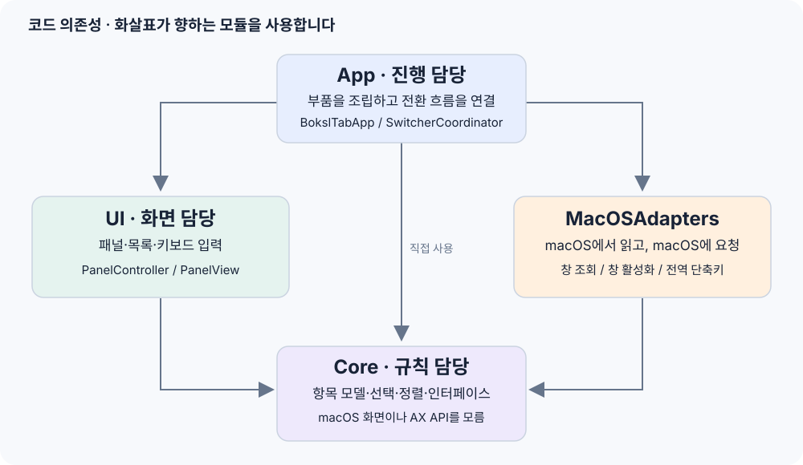
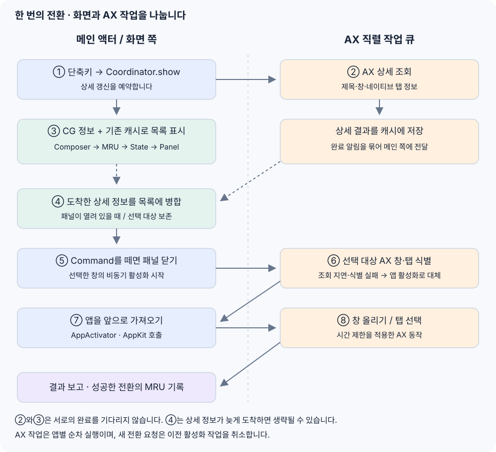
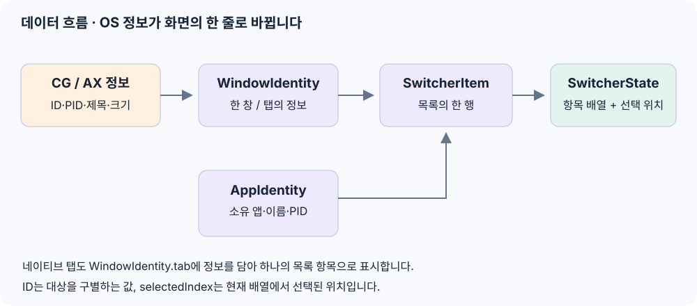

# BokslTab 소스코드 읽기 안내서

기준: `0be9d36` 커밋의 구현. 이 문서는 코드를 처음 읽는 사람을 위한 안내서다. 세부 설계는 [아키텍처 문서](architecture.md), 실행 방법은 [README](../README.md)를 참고한다.

**처음에는 `SwitcherCoordinator`를 중심에 놓고 읽으면 된다.** 이 파일이 단축키, 목록, 화면, 창 활성화를 연결한다. 나머지 파일은 이 흐름의 일부를 맡는다.

[그림과 단계별 탐색이 있는 자료 열기](source-code-guide.html)

## 1. 전체 구조: 진행·규칙·화면·macOS 연동

이 그림의 화살표는 “오른쪽 기능을 사용한다”는 뜻이다. 프로그램이 실행되는 순서를 뜻하지 않는다. 실제 모듈 의존성은 [Package.swift](../Package.swift)에 있다.

| 폴더 | 쉬운 설명 | 주로 답하는 질문 |
| --- | --- | --- |
| `Sources/BokslTabApp` | 전체 진행을 연결하는 곳 | 언제 목록을 열고, 어떤 대상을 전환할까? |
| `Sources/BokslTabCore` | 데이터와 동작 규칙 | 한 행은 무엇인가? 선택과 정렬은 어떻게 바뀔까? |
| `Sources/BokslTabUI` | 화면을 그리고 입력을 받는 곳 | 목록을 어떻게 보여주고 어떤 키를 처리할까? |
| `Sources/BokslTabMacOSAdapters` | macOS와 대화하는 곳 | 어떤 창이 있고, 그 창을 어떻게 앞으로 가져올까? |
| `Tests` | 변경 후 동작을 확인하는 곳 | 선택이 틀어지거나 느린 앱 때문에 멈추지 않을까? |
| `docs` | 제품·구조·검증 설명 | 전체 의도와 확인 방법은 무엇인가? |
| `scripts` | 개발용 앱을 만드는 도구 | 실행 가능한 `.app`을 어떻게 만들까? |

예를 들어 “선택을 다음 행으로 옮기는 규칙”은 Core, “선택한 행의 배경색”은 UI, “다른 앱의 창을 올리는 요청”은 MacOSAdapters, “Command를 떼면 전환하라”는 연결은 App에 있다.

## 2. 앱이 시작될 때

출발점은 [BokslTabApp.swift](../Sources/BokslTabApp/BokslTabApp.swift)다.

1. `BokslTabApplication`이 메뉴바 메뉴를 정의한다.
2. `AppDelegate.applicationDidFinishLaunching`이 로그를 켜고 필요한 부품을 만든다.
3. `MacOSAccessibilityService` 한 개를 창 목록 제공자와 창 활성화기에 함께 전달한다.
4. 만들어 둔 부품을 `SwitcherCoordinator`에 전달하고 `start()`를 호출한다.
5. `start()`는 상세 창 정보의 초기 갱신을 예약하고, 전역 단축키를 등록한다.

여기서 **부품을 만든다는 것**은 `MacOSWindowCatalogProvider()` 같은 객체를 생성한다는 뜻이다. **전달한다는 것**은 coordinator가 스스로 모든 부품을 만들지 않고, 밖에서 만든 것을 받아 사용한다는 뜻이다. 그래서 테스트에서는 실제 macOS 대신 가짜 부품을 넣을 수 있다.

`--smoke-test`와 `--restore-native-command-tab`은 시작 과정에서 따로 처리하는 진단용 실행 옵션이다. 평상시 전환 흐름을 읽을 때는 우선 건너뛰어도 된다.

## 3. Cmd+Tab 한 번을 따라가기

| 단계 | 코드에서 찾을 이름 | 일어나는 일 |
| --- | --- | --- |
| 1. 단축키 입력 | `registerHotkeys` → `show` | 단축키 서비스가 모드를 알려주고 coordinator가 목록 표시를 시작한다. |
| 2. 상세 갱신 예약 | `requestRefresh(including:)` | AX 조회를 백그라운드 작업 큐에 넣는다. 이 요청의 완료를 기다리지 않는다. |
| 3. 기본 목록 표시 | `presentation` → `SwitcherItemComposer` → `panelController.show` | 현재 창 정보와 캐시로 행을 만들고 최초 MRU 정렬 후 상태를 저장해 보여준다. |
| 4. 늦게 온 정보 반영 | `onDidRefresh` → `refreshVisibleItems` | 패널이 열려 있으면 상세 정보를 병합한다. 선택한 대상을 보존한다. |
| 5. 선택 확정 | `handle` → `activateSelectedItem` | Command를 떼거나 Enter를 누르면 패널을 닫고 선택한 창의 비동기 활성화를 시작한다. |
| 6. 대상 식별 | `MacOSWindowActivator.activate` → `MacOSAccessibilityService.run` | AX로 정확한 창·탭을 찾는다. 지연·식별 실패면 앱 활성화로 대체한다. |
| 7. 앱 포커스 | `MacOSAppActivator.activate` | 메인 쪽에서 소유 앱을 앞으로 가져온다. |
| 8. 창·탭 동작과 결과 | `performActivation` → `recordActivatedItem` / `reportSwitchResult` | 작업 큐에서 창 올리기·탭 선택을 요청하고 결과를 메인 쪽에 전달한다. |

상세 갱신은 사용자의 키 입력과 별개로 끝난다. Command를 먼저 떼면 4단계가 일어나기 전에 전환할 수 있다. 열린 목록의 갱신에서는 처음의 MRU 정렬을 다시 적용하지 않고, 기존 행 순서와 선택 대상을 유지한다.

**선택 이동**은 `handle` → `moveNext` / `movePrevious`로 위치를 바꾼 뒤 패널을 갱신한다. 같은 모드의 목록이 이미 열렸다면 추가 Cmd+Tab도 다음 항목으로 이동한다.

**Esc는 다른 흐름이다.** `cancelAndRestoreFocus()`가 목록을 닫고 이전에 사용하던 앱으로 포커스를 돌린다. 다른 곳을 클릭해 포커스를 잃으면 `dismissPanelWithoutRestoringFocus()`로 닫는다.

**앱 항목과 창 항목도 다르다.** 창 정보가 없는 활성 앱 모드는 앱 항목을 보여줄 수 있다. 이 항목은 `AppActivator`로 앱을 다시 여는 요청을 보낸다. 창 항목은 `WindowActivator`로 특정 창·탭을 식별하고 활성화한다. 모든 앱/창 모드는 현재 코드에서 창 항목을 조합하며, 창이 없는 앱의 행을 별도로 추가하지 않는다.

## 4. 화면의 한 줄은 어떤 데이터인가?

[Models.swift](../Sources/BokslTabCore/Models.swift)와 [SwitcherState.swift](../Sources/BokslTabCore/SwitcherState.swift)를 함께 보면 된다.

| 이름 | 뜻 | 예시 |
| --- | --- | --- |
| `AppIdentity` | 실행 중인 앱의 정보 | 앱 이름, 프로세스 번호(PID), 번들 식별자 |
| `WindowIdentity` | 창 한 개의 정보 | 창 ID, 소유 앱 PID, 제목, 선택할 탭 정보 |
| `WindowTabIdentity` | 네이티브 창 탭의 정보 | 부모 창 ID, 탭 위치, 탭 제목 |
| `SwitcherItem` | 목록에 표시할 한 행 | 소유 앱 + 앱 항목 또는 창 항목 |
| `SwitcherState` | 지금 보여주는 목록의 상태 | 전환 모드 + 항목 배열 + 선택 위치 |
| `SwitchResult` | 전환 요청의 결과 | 정확한 창 성공, 앱 대체 성공, 안전한 실패 |

IntelliJ의 한 창에 프로젝트 탭이 세 개 있으면 탭 정보가 들어 있는 `WindowIdentity`로 세 행을 만들 수 있다. 브라우저의 웹 페이지 탭을 모두 펼치는 기능은 아니다. 지원하는 네이티브 창 탭만 대상으로 한다.

`selectedIndex`는 “배열의 몇 번째 행을 선택했는지”이고, 항목의 `id`는 “어떤 대상을 가리키는지”다. 앞에 행이 늘어나면 위치는 바뀔 수 있다. 그래서 갱신 시에는 위치뿐 아니라 대상 ID, 탭 제목, 부모 창을 확인한다. 선택한 탭이 사라졌다고 다른 탭으로 임의 전환하지 않는다.

## 5. 가장 헷갈리는 부분: 조회와 활성화, 캐시와 재시도

**목록 조회**는 “표시할 항목이 무엇인가?”를 알아내는 일이다. **활성화**는 “사용자가 고른 창을 앞으로 가져오라”는 요청이다. 두 일은 `MacOSWindowCatalogProvider`와 `MacOSWindowActivator`가 각각 맡는다. 둘은 같은 접근성 서비스를 사용하지만 같은 작업은 아니다.

### CG와 AX

- **CG(CoreGraphics)**: macOS에서 현재 화면의 창 ID·소유 앱·크기·제목 등의 정보를 읽는다. 기본 목록의 재료다.
- **AX(Accessibility)**: 다른 앱에 창·탭의 상세 정보를 묻고, 특정 창을 올리거나 탭을 누르는 요청을 보낸다. 앱 응답이 느릴 수 있다.

기본 CG 정보와 이미 가진 캐시를 먼저 쓰고, AX 상세 조회는 백그라운드에서 처리한다. CG 목록 읽기 자체는 메인 쪽에서 이뤄진다. “모든 OS 호출이 백그라운드”라는 구조는 아니다.

### 저장하는 내용이 서로 다르다

| 담당 | 저장하거나 관리하는 것 | 관리 기준 |
| --- | --- | --- |
| `BackgroundRefreshCache` | 앱별 AX 상세 스냅샷, 진행 중 갱신 | 상세 값은 5초 유효, 갱신 간격 0.5초, 앱별 중복 요청 방지 |
| `WindowTitleCache` | 제목 보완용 최근 창 제목 | 제목이 약한 창에 보완, 기본 최대 64개 앱 |
| `AccessibilityWindowEventCache` | AX 이벤트로 관찰한 창과 AX 핸들 | 구독한 앱의 최근 창, 앱별 최대 32개 |
| `MacOSAccessibilityService` | 앱별 재시도 가능 시각 | 응답 실패·시간 소진 시 AX 요청을 15초 유예 |
| `MacOSMRUOrderingProvider`의 이력 | 최근 사용한 앱·창의 대상 ID | 메모리에 최대 100개, CG 순서와 함께 정렬에 사용 |

세 캐시 모두에 5초 제한이 있는 것은 아니다. **재시도 유예는 값의 캐시와 별도로, 접근성 서비스 한 곳에서 관리한다.** MRU는 최근 사용 순서를 위한 이력이다.

### 응답하지 않는 앱이 있을 때

`MacOSAccessibilityService`가 AX 작업을 직렬 큐에서 실행하고 `AccessibilityQueryBudget`를 각 조회·동작에 전달한다. 작업들이 모두 동시에 실행되는 방식은 아니다.

- 조회: 개별 AX 호출 80ms, 앱별 작업 250ms를 기준으로 제한한다.
- 창 올리기·탭 선택: 개별 동작 250ms, 작업 1초를 기준으로 제한한다.
- 응답 실패나 시간 소진은 해당 앱에 15초 유예를 적용한다. 그동안 기본 창 행이 남을 수 있고, 선택 시 앱 활성화로 대체할 수 있다.
- 새 전환 요청과 종료는 이전 활성화 작업을 취소한다. 취소는 이후 요청을 막는 것이며 이미 보낸 OS 동작을 되돌리는 것은 아니다.

이 값은 AX에 설정하는 요청 제한이다. 작업 큐에서 기다리는 시간을 포함한 전체 전환 시간이 반드시 250ms 이내라는 뜻은 아니다.

## 6. 파일 지도: 필요할 때 찾아보기

### App

| 파일 | 먼저 볼 곳 | 역할 |
| --- | --- | --- |
| [BokslTabApp.swift](../Sources/BokslTabApp/BokslTabApp.swift) | `applicationDidFinishLaunching` | 메뉴바, 앱 수명 주기, 서비스 조립 |
| [SwitcherCoordinator.swift](../Sources/BokslTabApp/SwitcherCoordinator.swift) | `show`, `handle`, `activateSelectedItem` | 목록·상태·화면·전환을 연결하는 중심 |

### Core

| 파일 | 역할 |
| --- | --- |
| [Models.swift](../Sources/BokslTabCore/Models.swift) | 앱·창·탭·행의 데이터와 전환 결과 |
| [Ports.swift](../Sources/BokslTabCore/Ports.swift) | 목록 제공·활성화·단축키 등 부품이 지킬 인터페이스 |
| [SwitcherState.swift](../Sources/BokslTabCore/SwitcherState.swift) | 선택 이동·갱신 병합·목록 행 조합 |
| [SwitcherMRUOrdering.swift](../Sources/BokslTabCore/SwitcherMRUOrdering.swift) | 최근 사용 정보로 정렬하고 최초 선택 위치 결정 |
| [StableWindowTitleKey.swift](../Sources/BokslTabCore/StableWindowTitleKey.swift) | 제목의 변동 부분을 정규화해 이력 매칭에 사용 |

### UI

| 파일 | 역할 |
| --- | --- |
| [SwitcherPanelController.swift](../Sources/BokslTabUI/SwitcherPanelController.swift) | AppKit 패널의 표시·닫기·크기, 키 이벤트를 동작으로 변환 |
| [SwitcherPanelView.swift](../Sources/BokslTabUI/SwitcherPanelView.swift) | SwiftUI 행·아이콘·경고·스크롤과 화면 배치 계산 |
| [SwitcherKeyboardAction.swift](../Sources/BokslTabUI/SwitcherKeyboardAction.swift) | 다음·이전·확정·취소 등 입력 동작의 종류 |
| [SwitcherKeyHoldRepeater.swift](../Sources/BokslTabUI/SwitcherKeyHoldRepeater.swift) | 누른 키의 연속 이동과 반복 속도 |

### MacOSAdapters

| 파일 | 역할 |
| --- | --- |
| [MacOSRunningAppProvider.swift](../Sources/BokslTabMacOSAdapters/MacOSRunningAppProvider.swift) | 실행 중인 일반 앱과 활성 앱 조회 |
| [MacOSWindowCatalogProvider.swift](../Sources/BokslTabMacOSAdapters/MacOSWindowCatalogProvider.swift) | CG 창과 각 캐시를 조합해 최종 창 목록 생성 |
| [AccessibilityWindowDiscovery.swift](../Sources/BokslTabMacOSAdapters/AccessibilityWindowDiscovery.swift) | 한 앱의 AX 창·주 창·포커스 창을 스냅샷으로 조회 |
| [WindowSnapshots.swift](../Sources/BokslTabMacOSAdapters/WindowSnapshots.swift) | CG 파싱, 스냅샷, 합성 창 ID와 기하 정보 |
| [WindowCatalogPolicies.swift](../Sources/BokslTabMacOSAdapters/WindowCatalogPolicies.swift) | 창 매칭·제목 보완·중복 제거·AX 전용 창 규칙 |
| [WindowTabCatalog.swift](../Sources/BokslTabMacOSAdapters/WindowTabCatalog.swift) | 탭 지원 앱 판별·AX 탭 해석·행 확장 |
| [WindowTitleCache.swift](../Sources/BokslTabMacOSAdapters/WindowTitleCache.swift) | 최근 창 제목 보관과 제목 보완 |
| [AccessibilityWindowEventCache.swift](../Sources/BokslTabMacOSAdapters/AccessibilityWindowEventCache.swift) | AX 알림 구독·이벤트 수집·최근 창과 핸들 보관 |
| [AccessibilityEventHistory.swift](../Sources/BokslTabMacOSAdapters/AccessibilityEventHistory.swift) | 이벤트 이력의 보존·매칭·목록 변환 |
| [BackgroundRefreshCache.swift](../Sources/BokslTabMacOSAdapters/BackgroundRefreshCache.swift) | 상세 값의 유효 기간·중복 갱신·완료 알림 묶기 |
| [MacOSAccessibilityService.swift](../Sources/BokslTabMacOSAdapters/MacOSAccessibilityService.swift) | 공통 AX 작업 큐·앱별 재시도 제한·비동기 작업 취소 |
| [AccessibilityQueryBudget.swift](../Sources/BokslTabMacOSAdapters/AccessibilityQueryBudget.swift) | 개별 조회·동작의 시간 제한과 교체 가능한 AX API |
| [AXElementReader.swift](../Sources/BokslTabMacOSAdapters/AXElementReader.swift) | AX 값에서 문자열·좌표·크기·요소를 읽는 공통 도구 |
| [MacOSActivation.swift](../Sources/BokslTabMacOSAdapters/MacOSActivation.swift) | 앱·창·탭 활성화와 정확한 대상 매칭, 실패 시 앱 대체 |
| [MacOSMRUOrderingProvider.swift](../Sources/BokslTabMacOSAdapters/MacOSMRUOrderingProvider.swift) | 현재 CG 창 순서와 앱 활성화 이력으로 MRU 정보 생성 |
| [PrioritizedGlobalHotkeyService.swift](../Sources/BokslTabMacOSAdapters/PrioritizedGlobalHotkeyService.swift) | 기본 단축키 대체 방식의 우선순위와 실패 시 정리 |
| [NativeCommandTabHotkeyService.swift](../Sources/BokslTabMacOSAdapters/NativeCommandTabHotkeyService.swift) | macOS 기본 Cmd+Tab 상태 변경·복원 |
| [CommandTabEventTapHotkeyService.swift](../Sources/BokslTabMacOSAdapters/CommandTabEventTapHotkeyService.swift) | 필요할 때 Cmd+Tab 입력을 가로채는 EventTap 방식 |
| [CarbonGlobalHotkeyService.swift](../Sources/BokslTabMacOSAdapters/CarbonGlobalHotkeyService.swift) | Carbon API로 전역 단축키 등록·해제 |
| [MacOSPermissionAdvisor.swift](../Sources/BokslTabMacOSAdapters/MacOSPermissionAdvisor.swift) | 접근성·화면 정보 권한 상태와 접근성 안내 |
| [BokslTabDiagnosticLog.swift](../Sources/BokslTabMacOSAdapters/BokslTabDiagnosticLog.swift) | 비동기 파일 로그와 파일 크기 제한 |

단축키 서비스가 여러 개인 이유는 macOS 기본 Cmd+Tab과의 우선순위 때문이다. 기본 단축키 비활성화가 가능하면 Carbon으로 등록한다. 어렵다면 EventTap으로 Cmd+Tab을 처리하고 나머지를 Carbon에 맡기는 방식을 시도한다. 실패 시 정리하고, 활성 앱 단축키만 실패한 경우 coordinator가 기본 단축키만 재등록한다.

## 7. 원하는 변경을 어디에서 시작할까?

| 바꾸고 싶은 것 | 시작 파일·이름 | 같이 확인할 테스트 |
| --- | --- | --- |
| 행 색상·아이콘·글꼴·간격 | `SwitcherPanelView` / `SwitcherPanelLayout` | `SwitcherPanelLayoutTests` |
| 목록 위치·표시·닫기 | `SwitcherPanelController` | `SwitcherPanelLayoutTests` |
| 다음·이전·취소 키 | `SwitcherKeyboardMapper`와 `SwitcherKeyboardAction` | `SwitcherKeyboardMapperTests` |
| 키를 길게 누를 때 속도 | `SwitcherKeyRepeatTiming` | `SwitcherKeyboardMapperTests`의 반복 동작 테스트 |
| 목록에 포함할 창·제목 보완 | `MacOSWindowCatalogProvider`와 `WindowCatalogPolicies` | `AXWindowMatchPolicyTests`, `WindowCatalogResponsivenessTests` |
| 네이티브 탭 지원·탭 펼치기 | `WindowTabCatalog` | `WindowTabPolicyTests` |
| 갱신 후 선택 유지 | `SwitcherState.mergeRefreshedItems` | `SwitcherRefreshTests` |
| 최근 사용 순서 | Core의 `SwitcherMRUOrderer`, macOS의 MRU 제공자 | `SwitcherStateTests`, `MacOSMRUOrderingProviderTests` |
| 특정 창·탭을 잘못 활성화 | `MacOSWindowActivator`와 AX 매칭 정책 | `MacOSActivationTests`, `WindowTabPolicyTests` |
| 응답 지연·재시도 시간 | `AccessibilityQueryBudget`, `MacOSAccessibilityService` | `AccessibilityQueryTests`, `MacOSActivationTests` |
| 전역 단축키·등록 실패 처리 | `Ports`의 기본 정의, 우선순위 서비스, coordinator | `HotkeyModifierMappingTests`, `HotkeyServiceLifecycleTests`, `SwitcherCoordinatorTests` |
| 로그 상세 수준·크기 | `BokslTabDiagnosticLog` | `DiagnosticLogTests` |

## 8. 코드를 읽기 위한 최소 용어

| 용어 | 여기서의 뜻 |
| --- | --- |
| `struct` | 앱·창·선택 상태처럼 값을 담는 타입. 상태 값은 복사해서 다룰 수 있다. |
| `class` | 작업 큐·캐시·화면처럼 수명과 내부 상태를 가진 객체. |
| `protocol` / Port | 부품이 어떤 기능을 제공해야 하는지 정의한 계약. 실제 구현은 다른 파일에 있다. |
| Provider | 정보를 제공하는 부품. 예: 창 목록 제공자. |
| Activator | 앱·창을 활성화하는 부품. |
| Policy | 입력을 보고 결론을 내리는 규칙. 예: 제목이 중복되면 정확한 창으로 단정하지 않기. |
| Snapshot | OS에서 읽은 정보를 다루기 쉬운 값으로 정리한 것. |
| MRU | Most Recently Used. 최근에 사용한 대상을 먼저 보여주는 순서. |
| PID | 실행 중인 프로세스의 번호. 앱 이름이 같아도 실행 대상을 구분할 수 있다. |
| `@MainActor` | 화면과 관련된 코드를 메인 액터에서 실행하도록 하는 표시. |
| `async` / `await` | 결과를 기다리는 동안 실행을 양보하는 방법. 이것만으로 작업이 자동으로 별도 스레드로 옮겨지는 것은 아니다. |
| Callback / Closure | 작업이 끝났거나 입력이 왔을 때 호출할 함수. 예: `onDidRefresh`. |
| Fallback | 정확한 동작이 어려울 때 적용하는 대체 동작. 예: 특정 창 대신 앱을 활성화. |

`MacOSAccessibilityService.run`은 `await`로 결과를 기다릴 수 있게 하고, **실제 AX 작업은 명시적으로 `workerQueue`에 넣는다.** 이 두 역할을 구분하면 비동기 코드를 읽기 쉬워진다.

## 9. 추천 읽기 순서와 확인 방법

다음 여섯 파일에서 시작한다. 처음에는 전체 함수를 다 읽지 말고 아래 이름을 검색해 연결만 따라간다.

1. `BokslTabApp.swift` → `applicationDidFinishLaunching`: 부품이 만들어지는 곳.
2. `SwitcherCoordinator.swift` → `show`, `handle`, `activateSelectedItem`: 사용자 동작을 연결하는 곳.
3. `Models.swift` → `SwitcherItem`, `WindowIdentity`: 무엇을 주고받는지.
4. `SwitcherState.swift` → `moveNext`, `mergeRefreshedItems`: 선택이 어떻게 변하는지.
5. `SwitcherPanelController.swift` → `show`, `update`, `hide`: 화면에 어떻게 반영하는지.
6. `MacOSWindowCatalogProvider.swift` → `requestRefresh`, `windowsForAllApps`: 목록 정보를 어디서 얻는지.

그다음 관심 있는 변경에 맞춰 7절의 파일로 들어간다. AX API의 세부 호출이나 단축키 우회 처리부터 읽을 필요는 없다.

수정 후에는 프로젝트 루트에서 `swift test`를 실행한다. 실제 다른 앱의 창·탭 전환은 손쉬운 사용 권한이 있는 개발용 앱에서 따로 확인해야 한다. 자동 테스트는 가짜 부품과 가짜 AX 응답을 사용하므로 실제 앱의 동작 전체를 대신하지 않는다.

AI에 수정을 요청할 때는 다음 세 가지를 함께 적으면 검토하기 쉽다.

- 원하는 사용자 동작: 예를 들어 “상세 정보가 늦게 와도 선택한 탭을 바꾸지 않는다.”
- 관련 책임과 파일: 예를 들어 “선택 유지 규칙인 `SwitcherState`를 먼저 확인한다.”
- 검증할 결과: 예를 들어 “선택 앞에 탭이 추가돼도 같은 대상을 유지하는지 테스트한다.”

구조를 이해했는지 확인하려면 “화면을 바꾸는 함수”, “다른 앱에 AX 요청을 보내는 함수”, “선택 대상 보존을 결정하는 함수”를 각각 하나씩 찾을 수 있는지 보면 된다.
